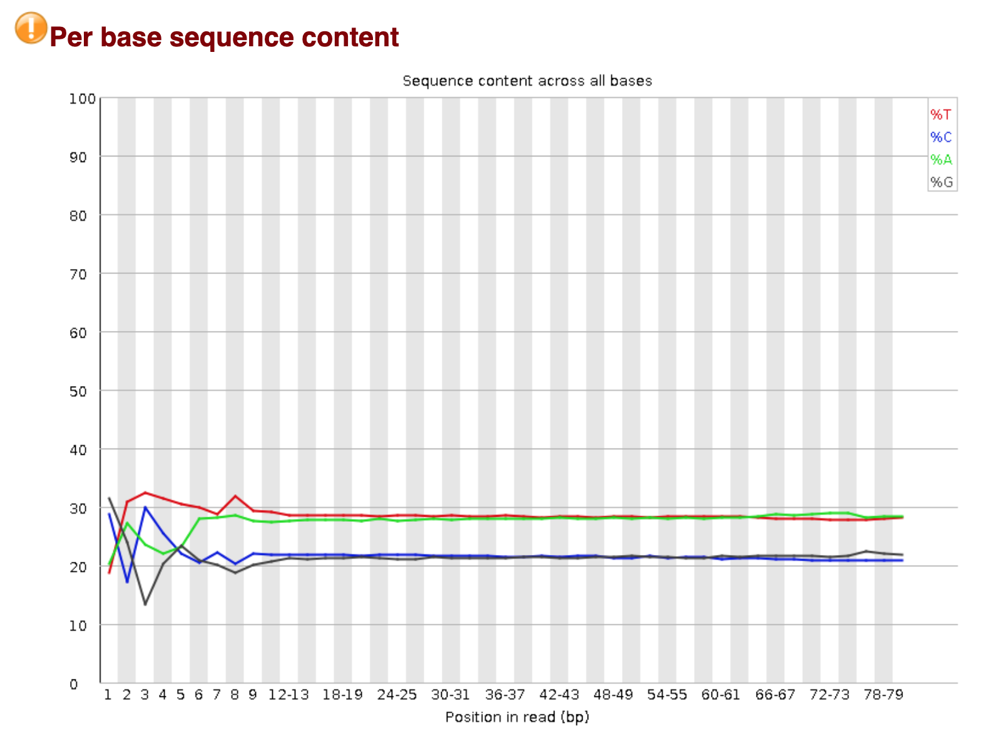

Ссылка на [коллаб](https://duckduckgo.com)https://colab.research.google.com/drive/1afyu03E0bTZdkTlk4jrDWpF1f4pAHaD0?usp=sharing)

## Задание 1.

Сравниваем fastq для SRR5836473_1 и fastq из прошлого дз по структуре хроматина (это ДНК или РНК организма Pleurobrachia Bachei).

| SRR5836473_1 | Прошлое дз |
|-------------------|-------------------|
|  |  | 
|  |  | 
|  |  | 
|  |  | 

Скриншоты из SRR5836473_1:

Скриншоты из прошлого дз:

Сравнение: 

Видим в Per base sequence content, что в SRR5836473_1 несколько большее содержание тимина, и несколько меньшее – цитозина (и если посмотреть на содержание GC из Basic statistics, то увидим, что оно уменьшилось с 43% до 36%). При этом нет такого эффекта, который мы наблюдали в прошлой домашке, когда в начале распредление сильно отличается от последующего.

Судя по Per base sequence quality, качество секвенирования в целом сравнимое и довольно хорошее, а также ухадшается к концу, однако в SRR5836473_1 оно несколько хуже, но стабильнее – артефакт в конце не такой резкий.

В Per sequence GC content видим резкое искажение для SRR5836473_1. График в целом похож на смесь двух нормальных распределений.

## Задание 2.а, b)

|            | 11347700-11367700 | 40185800-40195800 | Deduplication |
|------------|-------------------|-------------------|---------------|
| SRR5836473 | 1090              | 464               | 81.69%        |
| SRR5836475 | 1456              | 630               | 90.92%        | 
| SRR3824222 | 2328              | 1062              | 97.08%        |

